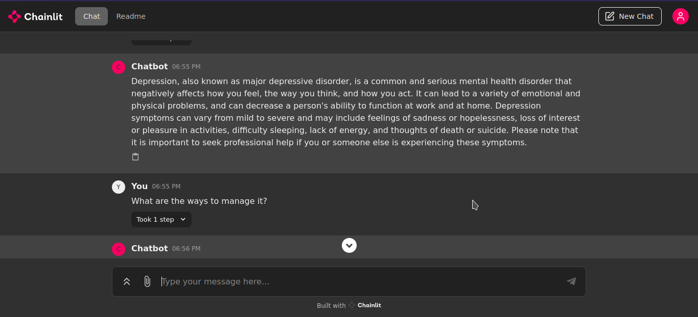

# Therapy Chatbot Assistant




The Therapy Chatbot Assistant is a project aimed at providing personalized therapy support through a conversational interface. Leveraging two models, GPT-4 through its API and Mistral-7B for local testing, this chatbot utilizes a RAG (Retrieval-Augmented Generation) implementation of Large Language Models (LLMs) for accurate responses.
I also used Chainlit to build a production ready Conversational AI interface.

## File Descriptions.

1.) Results - Folder containing screenshots of implementation of the model on a user interface.

2.) NLP_Tests - Folder containing different model implementations of NLP tasks with some being RAG-based.

3.) therapy_mistral_final_model.py - File containing therapy-based Mistral Model. 

4.) therapy_gpt_final_model.py - Main file containing therapy-based GPT-4 Model. Takes shorter time to run than Mistral.

5.) requirement.txt - List of libraries to install.

## Features

- **Personalized Therapy Support**: Users can interact with the chatbot to receive personalized therapy guidance and support.
  
- **RAG Implementation**: The chatbot utilizes a RAG implementation of LLMs to retrieve and generate accurate responses from a PDF of therapy-related information.

- **Conversational History**: Integration with Langchain ensures retaining and building upon past interactions, resulting in coherent and engaging dialogue across conversations.
.

## Installation

1. Clone the repository:
    ```bash
    git clone https://github.com/Stephen-Echessa/therapy-chatbot.git
    ```

2. Install dependencies:
    ```bash
    pip install -r requirements.txt
    ```

3. Obtain GPT-4 API keys:
    - Visit (https://openai.com/api/) to obtain API keys.
    - Add the keys to your environment variables or directly to the code.

## Usage

1. Run the chatbot:
    ```bash
    chainlit run therapy_gpt_final_model.py -w
    ```

2. Interact with the chatbot by typing your queries and receiving responses.
